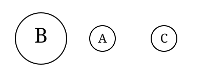

# 1 Introduction

In this document we introduce a software package for the classification of binary vectors and analysis of the classification results. During recent years we have studied various aspects of classification methodology at the department of applied mathematics of the University of Turku. Thus, the software package at hand has grown large. Essential tools in this work have been different kinds of classification or clustering algorithms and algorithms to analyze and collect the essential information of the classification results. We include a particularly large reference list to review the historical and recent studies.

First we will give a brief introduction to the mathematical foundations and theory of clustering, cumulative classification and mixture classification. We also introduce methods for analysis of the classifications including trees (dendrograms), comparison of the classifications and bootstrapping. A few pseudo-algorithms are presented. We discuss implementation details and alternatives which are included in BinClass and can be chosen by the user to compare their behavior in the real world.

The third and fourth chapters are the user's guide to the actual software package. BinClass is a powerful toolkit for the classification of binary vectors and numerical taxonomy. Its design is modular. Each module is an independent tool and performs a particular task. Common tasks of numerical taxonomy include: classification (clustering data), identification (cumulative classification), analysis and comparison of the classification results.

Most of the tasks are heavily memory and CPU consuming, and thus BinClass is meant to run mainly on high-end UNIX, Linux and Win32 (Windows NT) based workstations. Due to the command line interface and ANSI C compliance, BinClass compiles easily on most of the platforms available.

Finally, a short sample session is presented to give insight into how the software actually works and to illustrate the function of some of the many parameters.

# 2 Theory

## 2.1 Clustering

The main focus of BinClass is on classifying (clustering) data consisting of binary vectors. By clustering we mean division of the set of vectors to a set of disjoint subsets (clusters, classes) in such a way that *cost of the classification* is minimal. There are many methods available and some of them are implemented in BinClass.

The clustering problem is an important field of research in computer science. Classification of data is a fundamental tool in pattern recognition and vector quantization, which are applications of image processing and computer vision [17]. Classification is also important in neural and self learning systems [31]. Their applications vary widely from business to medicine. Our research group has been interested in the problem in the taxonomic sense, especially bacterial taxonomy [15]. The ability to classify things is undoubtly one of the key features of human intelligence. It is also well known that the clustering problem is a difficult one, and we have to resort on approximate solutions [8, 14].

We first discuss methods to measure the cost of classification. There are simple error measures such as MSE which are quite commonly used in many applications, and more complex ones such as *stochastic complexity*. We shall first discuss these and then the algorithms.

### 2.1.1 Minimum Error

Let us suppose that a set of binary vectors $\mathcal{X}^t$ of form $\mathbf{x}^{(l)} = (x_1^{(l)}, x_2^{(l)}, \ldots, x_d^{(l)})$, $x_i^{(l)} \in [0, 1]$, denoted by $\mathcal{X}^t = \{\mathbf{x}^{(l)} | l=1, 2, \ldots, t\}$ is classified to a set of $k$ disjoint classes $C = \{C_1, \ldots, C_k\}$, $C_j = \{\mathbf{x}^{(l)} | l=1, 2, \ldots, t_j\}$, $j \in [1, \ldots, k]$ by some method. Then for each class $C_j$ we compute the number of the ones in each column $i$ by:

$$
t_{ij} = \sum_{l=1}^{t_j} x_i^{(l)}
\quad (1)
$$

and define the centroid of the class $C_j$ by:

$$
\hat{\theta}_j = (\hat{\theta}_{1j}, \ldots, \hat{\theta}_{d_j}), \hat{\theta}_{ij} = \frac{t_{ij}}{t_j}.
$$

Furthermore, we define the *Hypothetical Mean Organism (HMO)*, by rounding $\hat{\theta}_j$:

$$
\mathbf{a}_j = (a_{1j}, \ldots, a_{d_j}), a_{ij} = [\hat{\theta}_{ij} + 1/2] \quad (2)
$$

Later we call $\mathbf{a}_j$ the *class representative* of the class $C_j$. Now we define various error measures for the classification $C$. In the simplest case the distance of each vector to its class is the Hamming-distance to $\mathbf{a}_j$:
$$ \rho(\mathbf{x}^{(t)}, C_j) = \sum_{i=1}^d |x_i^{(t)} - a_{ij}|. \quad (3) $$

We can easily approximate the *distortion* or *incoherence* of a single class by:
$$ \mathcal{I}(C_j) = \frac{1}{t_j} \sum_{\mathbf{x} \in C_j} \rho(\mathbf{x}, C_j). \quad (4) $$

We can also define the distance with $L_1$ or $L_2$ norms and $\hat{\theta}_j$:
$$ L_1(\mathbf{x}^{(t)}, C_j) = ||\mathbf{x}^{(t)}, C_j||_1 = \sum_{i=1}^d |x_i^{(t)} - \hat{\theta}_{ij}|, \quad (5) $$
$$ L_2(\mathbf{x}^{(t)}, C_j) = ||\mathbf{x}^{(t)}, C_j||_2^2 = \sum_{i=1}^d \left(x_i^{(t)} - \hat{\theta}_{ij}\right)^2, \quad (6) $$
respectively. This gives us together with the $\hat{\theta}_j$ an alternate method to define the class representative as the closest vector to the centroid:
$$ \hat{\mathbf{a}}_j = \arg\min_{t=1}^{t_j} L_2(\mathbf{x}^{(t)}, C_j) $$

Now the total error produced by the classification $C$ can be expressed as:
$$ \mathcal{E}(\mathcal{X}^t, C) = \sum_{j=1}^k \sum_{t=1}^{t_j} \mathcal{D}(\mathbf{x}^{(t)}, C_j) \quad (7) $$

where $\mathcal{D}(\mathbf{x}^{(t)}, C_j)$ is either $\rho(\mathbf{x}^{(t)}, C_j)$, $L_1(\mathbf{x}^{(t)}, C_j)$ or $L_2(\mathbf{x}^{(t)}, C_j)$. Note that by all of these criteria the number of classes $k$ producing minimal error is $t$, i.e. the classification to $t$ singleton classes. This means that (7) does not measure the cost of the classification structure. Usually $t \gg k$, and it is desirable to find out the optimal number of classes in the data. Next we shall discuss that problem and at the same time we take a more theoretical look at the classification problem.

### 2.1.2 Stochastic Complexity
According to Rissanen [35], the best model to explain a given set of data is the one which minimizes the sum of (1) the length in bits of the description
of the model, and (2) the length in bits of the description of the data with the help of the model. This is the so-called Occam's razor, the principle that tells us not to introduce more concepts than necessary to explain observed facts. Classifying a collection of items (here binary vectors) according to some specified method (classification model) can be viewed as a means for encoding information about the data. Following this principle, according to Rissanen the best classification is therefore the one which requires the least number of bits to code the classification with respect to the model chosen, and to code the items within the classification.

Let $\mathcal{X}^t = \{\mathbf{x}^{(l)} | l=1, 2, \ldots, t\}$ be a set of $t$ elements of the form $\mathbf{x}^{(l)} = (x_1^{(l)}, x_2^{(l)}, \ldots, x_d^{(l)})$, $x_i^{(l)} \in [0, 1]$ for all $l \in [1, 2, \ldots, t]$, $i \in [1, 2, \ldots, d]$. Our task is to determine a classification of $\mathcal{X}^t$ into $k$ classes so that the *cost of the classification* is minimal. Let us consider the idea of a family of *latent classes* to $k$ denoted by $C_j = \{\mathbf{x}^{(l)} | l=1, 2, \ldots, t_j\}$, $j \in [1, \ldots, k]$. Conditionally, on any $C_j$ we consider the multivariate Bernoulli distribution:

$$ p(\mathbf{x}|\theta_j, C_j) = \prod_{i=1}^d \theta_{ij}^{x_i}(1 - \theta_{ij})^{1-x_i}. \quad (8) $$

Here

$$ \theta_{ij} = P(x_i = 1 | \theta_j C_j). $$

Let us suppose that there is a *mixing distribution* $\lambda_j; j=1, \ldots, k; \lambda_j \ge 0; \sum_{j=1}^k \lambda_j = 1$. Then we think of $\mathcal{X}^t$ as being generated by two-stage *sampling procedure* so that first $C_j$ is drawn using $\lambda_j; j=1, \ldots, k$ and then $\mathbf{x}^{(l)}$ is drawn using the corresponding $p(\mathbf{x}|\theta_j, C_j)$. Hence, the probabilistic model class is the finite mixture:

$$ p(\mathbf{x}|\Theta, \Lambda) = \sum_{j=1}^k \lambda_j p(\mathbf{x}|\theta_j, C_j), \Lambda = \{\lambda_1, \ldots, \lambda_k\}, \Theta = \{\theta_1, \ldots \theta_k\}. $$

However, some of this information is actually hidden, so that we do not have the identity of $C_j$ at our disposal when getting $\mathbf{x}^{(l)}$. The parameters $(\theta_j, \lambda_j)$ will also be regarded as unknown. Let us set:

$$ v_j^{(l)} := \begin{cases} 1 & \text{if } x^{(l)} \text{ is sampled for } p(\mathbf{x}|\theta_j, C_j) \\ 0 & \text{otherwise} \end{cases} $$

Thus, the full information data is:

$$ (\mathbf{x}^{(l)}, v_j^{(l)})_{l=1,j=1}^{t,k}. $$

The classification problem is now to estimate $u_j^{(l)}$ using the partial information data $\mathbf{x}^{(l)}$. Clearly this task is related to forming estimates of $\theta_j$

and $\lambda_j$, which we shall denote by $\hat{\theta}_j$ and $\hat{\lambda}_j$ respectively. First we assume that $\mathbf{x}^{(1)}, \ldots, \mathbf{x}^{(t)}$ are independent samples of the mind described above. Then the joint distribution of $(\mathbf{x}^{(l)}, v_j^{(l)})$ is

$$
\prod_{l=1}^t \prod_{j=1}^k \left(p(\mathbf{x}^{(l)}|\theta_j, C_j)\lambda_j\right)^{v_j^{(l)}}. \quad (9)
$$

Our strategy is to get rid of $\theta_j$ and $\lambda_j$ in expression (9) in such a way that what remains is a likelihood function for $(\mathbf{x}^{(t)}, u_j^{(l)})_{j=1,j=1}^t$. One way to do this is *model averaging*, i.e. we form

$$
L(\mathcal{X}^t, u; k) = \int \prod_{i=1}^t \prod_{j=1}^k \left(p(\mathbf{x}^{(l)}|\theta_j, C_j)\lambda_j\right)^{u_j^{(l)}} d\omega(\Theta, \Lambda).
$$

Then

$$
\text{SC}_n(\mathcal{X}^t, u) = -\log_2 L(\mathcal{X}^t, u; k)
$$

is called *stochastic complexity*. This is clearly a generalized log-likelihood function that only depends on the variable directly connected to the classification problem. Let us now suppose that we have fixed some estimates of $C_j$ in the form of a partition of the training set $\mathcal{X}^t$. Thus we have

$$
\mathcal{C}_j = \{\mathbf{x}|l=1, 2, \ldots, t_j\}, j=1, \ldots, k
$$

and we compute

$$
t_{ij} = \sum_{i=1}^{t_j} x_i^{(l)}
$$

Then, if we chose $\omega(\Theta, \Lambda)$ as a product of appropriate uniform prior distribution we get

$$
\text{SC} = \log_2 \left(\frac{t!}{t_1!\ldots t_k!}\right) + \log_2 \binom{t+k-1}{t} + \sum_{j=1}^k \sum_{i=1}^d \log_2 \left(\frac{(t_j+1)!}{t_{ij}!(t_j-t_{ij})!}\right). \quad (10)
$$

Alternatively, if we chose $\omega(\Theta, \Lambda)$ as a product of a Jeffreys prior we get

$$
\begin{aligned}
\text{SC} = &\left(dk + \frac{k}{2}\right)\log_2(\pi) + \log_2 \left(\frac{\Gamma(k/2)\Gamma(t+k/2)}{\sum_{j=1}^k \Gamma(t_j+1/2)}\right) \\
&+\sum_{j=1}^k \sum_{i=1}^d \log_2 \left(\frac{\Gamma(t_j)}{\Gamma(t_{ij}+1/2)\Gamma(t_j-t_{ij}+1/2)}\right), \quad (11)
\end{aligned}
$$

where $t_j$ is the number of binary vectors in class $C_j$, and $t_{ij}$ is the number of binary vectors in the class $C_j$ with the $i^{\text{th}}$ bit equal to 1 (log denotes the logarithm to the base 2). The first two terms in equation (10) describe the complexity of the classification structure, and the last term the complexity of the binary vectors with respect to the classification.

## 2.1.3 Algorithms

So far we have discussed mathematical criteria to measure the goodness or the cost of the classification. The next task is simply to generate a classification, by optimizing MSE, SC or some other criteria. The naive method to do this is to check every possible classification and calculate the criteria for each of them as described above and choose the one producing the optimum.

Let us take a quick view to the complexity of the problem. The number of the unique vectors to be classified is $t$, and we need to find a classification into $k$ classes. Then the multinomial number $\binom{t}{t_1, \ldots, t_k}$ is the number of classifications whose class sizes are $t_1, ..., t_k$. Thus the number of all classifications of $k$ classes is:

$$
\sum_{t_1 + \cdots + t_k = t; \forall j: t_j > 0} \binom{t}{t_1, \ldots, t_k}.
$$

In this case the ordering of the classes does not matter, i.e. classifications $(ab|c)$ and $(c|ab)$ are equivalent. Thus, we have to eliminate $k!$ from such orderings, which gives us the formula:

$$
S(t,k) = \frac{1}{k!} \sum_{t_1 + \cdots + t_k = n; \forall j: t_j > 0} \binom{t}{t_1, \ldots, t_k},
$$

whose explicit form is:

$$
S(t,k) = \frac{1}{k!} \sum_{j=0}^k (-1)^{k-j} \binom{k}{j} j^t. \quad (12)
$$

$S(t,k)$ is also know as *Stirling's number of the second kind* [2]. We immediately see it is growing exponentially. Moreover, it has been proven that finding the taxonomic key and the generalized Lloyd-max are NP-hard problems [8, 14]. Thus, we need more intelligent method to render a classification. To accomplish this, we need to loosen our criteria a little, namely, we will accept local optima. Many algorithms are suggested for the classification problem, each having its benefits and drawbacks. Usually more robust methods tend to have a longer running time. Perhaps the most abundantly used method is the *Generalized Lloyd Algorithm (GLA)* [17, 32], which is also known as *k-means* or the *Gray, Buzo, Linde*-algorithm. An outline of the algorithm is as follows

**GLA**

*Step 0.* Generate initial solution $C$ and calculate $\hat{\Theta}$ (and $\hat{\Lambda}$)

*Step 1.* Generate classification $C^{\text{new}}$
$\forall \mathbf{x}^{(l)}, l \in [1, ..., t]$
Determine class $j \in [1, ..., k]$ of $\mathbf{x}^{(l)}$ for which $\mathcal{D}(\mathbf{x}^{(l)}, C_j)$ assumes minimal value

*Step 2.* Recalculate $\hat{\Theta}$ (and $\hat{\Lambda}$) and let $C = C^{\text{new}}$

*Step 3.* Fix possible empty cell problem

*Step 4.* Repeat the so-called Lloyd-iteration of steps 1 and 2 until overall error $\sum_{j=1}^k \sum_{l=1}^{t_j} \mathcal{D}(\mathbf{x}^{(l)}, C_j)$ does not decrease anymore.

This algorithm also plays an important role in the more advanced methods. It will converge to local minima when $\mathcal{D}(\mathbf{x}^{(l)}, C_j)$ is correctly selected. A natural choice for $\mathcal{D}(\mathbf{x}^{(l)}, C_j)$ when using SC is the Shannon codelength:

$$ CL(\mathbf{x}^{(l)}, C_j) = -\sum_{i=1}^d \left((1-x_i^{(l)})\log_2(1-\hat{\theta}_{ij}) + x_{ij}^{(l)}\log_2\hat{\theta}_{ij}\right) - \log_2\hat{\lambda}_j \quad (13) $$

GLA is dependent on the quality of the initial solution generated in step 0. Usually randomization is applied here. The most typical way to generate the initial solution is as follows [39]:

*Step 0.1.* Draw $k$ vectors $\mathbf{z}^{(1)}, \ldots, \mathbf{z}^{(k)}$ from input set $\mathcal{X}^t$ randomly

*Step 0.2.* Set $\hat{\theta}_j = \mathbf{z}^{(l)}, j \in [1, ..., k]$

Note that the number of ways to choose the initial centroids is $\binom{k}{d}$, and thus we have to rely on the random centroids. Other widely used way to initialize this algorithm is presented by McQueen [40].

If we will use $CL(\mathbf{x}^{(l)}, C_j)$ as our nearest neighbor rule, we need two more steps:

*Step 0.3.* $\forall \mathbf{x}^{(l)}, l \in [1, ..., t]$:
Determine class $j \in [1, ..., k]$ of $\mathbf{x}^{(l)}$ for which $\mathcal{D}(\mathbf{x}^{(l)}, C_j)$ assumes minimal value, $\mathcal{D}(\mathbf{x}^{(l)}, C_j)$ being a distance measure which does not apply $\hat{\Lambda}$

*Step 0.4.* Calculate $\hat{\Lambda}$

The next open question to answer is the *empty cell (orphaned centroid)* problem introduced in step 3. Orphaned centroids have no vectors assigned to them in step 2 of the algorithm. It is clear that we must remedy this problem, otherwise the number of non-empty classes would be less than the prescribed $k$. The most natural way to fix the problem is to split one class in two [30]:

**Empty Cell Fix**

**Step 3.0.** For each orphaned centroid perform the following:  
*Step 3.1.* Denote the orphaned centroid with $\hat{\theta}_{j^*}$. Determine the class $C_j, j \in [1, ..., k]$, whose distortion (4) is the largest  

*Step 3.2.* Split the class $C_{\bar{j}}$:  
Apply a suitable split heuristic to the class $C_{\bar{j}}$: three examples  
a) move a random vector $\mathbf{x}^{(r)}$ from class $C_{\bar{j}}$ to $C_{j^*}$ and set $\hat{\theta}_{j^*} = \mathbf{x}^{(r)}$  
b) move a vector $\mathbf{x}^{(l)}, l \in [1, ..., t_j]$, whose distance $\mathcal{D}(\mathbf{x}^{(l)}, C_{\bar{j}})$ is the largest, to the class $C_{j^*}$ and set $\hat{\theta}_{j^*} = \mathbf{x}^{(l)}$  
c) find two vectors $\mathbf{x}^{(l)}$ and $\mathbf{x}^{(m)}, l, m \in [1, ..., t_j]$, whose distance $\rho(\mathbf{x}^{(l)}, \mathbf{x}^{(0)})$ from each other is the largest and set $\hat{\theta}_j = \mathbf{x}^{(l)}$ and $\hat{\theta}_{j^*} = \mathbf{x}^{(m)}$  

GLA is in many cases a good and quick method. The time complexity of the algorithm is $O(tk)$, where $t$ is the number of elements to be classified and $k$ is the number of classes. This is clear, because in the algorithm every element must be tested against each class. The number of iterations and the complexity of the distance calculations can be regarded as a constant. The drawback is that GLA is not robust, i.e. it can sometimes get stuck in not so good local minima. To remedy this problem we can either run GLA several times and choose the best local minimum, or then we can use a more advanced method such as *genetic algorithms*, *tabu search* [12], or *local search* [9]. Also *simulated annealing* [41] and other optimization strategies have been suggested. We will introduce the local search next.

**Local Search**  

*Step 1.* Draw $k$ random initial centroids from the input data set;  
*Step 2.* Run two iterations of GLA [32] with the $L_2$-metric. Let the result of the clustering be $\mathcal{C}_{\text{best}}$ and calculate SC($\mathcal{C}_{\text{best}}$) by formula (10);  
*Step 3.* Iterate the next steps until $t = \text{max-iter}$:  
    *Step 3.1.* Apply search operator to $\mathcal{C}_{\text{best}}$ and let the solution be $\mathcal{C}_{\text{mod}}$;  
    *Step 3.2.* Apply two iterations of GLA with $L_2$-metrics to the solution $\mathcal{C}_{\text{mod}}$;  
    *Step 3.3.* Calculate SC($\mathcal{C}_{\text{mod}}$);  
    *Step 3.4.* If SC($\mathcal{C}_{\text{mod}}$) > SC($\mathcal{C}_{\text{best}}$), then let the $\mathcal{C}_{\text{best}} := \mathcal{C}_{\text{mod}}$ and SC($\mathcal{C}_{\text{best}}$) := SC($\mathcal{C}_{\text{mod}}$);  
*Step 4.* Calculate $\hat{\Lambda}$;
*Step 5.* Apply GLA to minimize $D$ given by (13), $\mathcal{C}_{\text{best}}$ as initial solution until the result does not change.

## Multi-Operator Local Search

We can incorporate various operators in step 3, the best results are often obtained by utilizing many of them from time to time.

### SJ1: Split-and-join (variant 1)
It may be profitable to code two very close clusters as a single cluster and to use the centroid thus gained at some other part of the vector space. This is because a cluster with high internal distortion probably has a weak cluster representative (centroid). The SJ1 operator tries to fix this by joining the two closest clusters according to the $L_2$-distance of centroids and by splitting the most incoherent cluster according to the internal distortion (average Hamming-distance to cluster representative (4)).

### RWO: Replace-worst
As noted above, a cluster with high internal distortion is likely to be coded inefficiently when measured by *stochastic complexity*. The *Replace-worst* heuristic draws a new random centroid from the input data set for the most incoherent cluster. Incoherence is measured by the internal distortion (4). The application of GLA after this search operator will re-map the vectors.

### RSA: Replace-smallest
Small clusters are likely to be coded inefficiently, because a code word consumed by the coding of a small cluster could perhaps be used more efficiently for something else. Small clusters also emerge as a side effect of other search operators. One possibility to fix this is to draw a new random centroid for the smallest cluster. Again the application of GLA after this search operator re-maps the vectors.

### RSW: Random-swap
Global and random change of the cluster centroid is sometimes a good approach. In this way we can escape from a bad local minimum. The *random-swap* operation selects a random cluster and draws a new random centroid from the input data set for the chosen cluster. It may be that none of the other methods is applicable any longer, but the random-swap still helps us to proceed towards more promising regions of the search space.

### SJ2: Split-and-join (variant 2)

This operation joins the smallest cluster and its closest neighbor. The closeness of the clusters is measured by the $L_2$-metric between the cluster centroids. After the joining, the operation splits the most incoherent cluster according to the internal distortion (4).

**CMO: Class-move**
As noted with random-swap, it is necessary to introduce randomness in the search. On the other hand, the solution process may already be on the right track towards an advantageous region of the search space so that it is profitable to make only minor changes. This is pursued in the operation *class-move*, which is the same as random-swap with the only difference being that the new centroid is drawn randomly from the same cluster which was chosen to be replaced. This operation moves the cluster in search space in a random direction without destroying it completely.

**Adaptive Local Search**
Cyclical application of the LS operators in MOLS is in the long run very similar to a random choice of LS operators with uniform distribution. This observation helps us to enhance the multi-operator search further. Depending on the data, the initial values of the centroids and the state of the search, different search operators tend to work better than others. On the other hand, when a certain operator is used in succession its power may become exhausted. One way to overcome this shortcoming is to make the algorithm adaptive. This means that when one operator turns out to be successful (the application of the operator leads to a better value of the optimization criteria, here stochastic complexity), the algorithm should use it more frequently. When doing this, we should still maintain some possibility to switch to another search operator at a later stage of the solution process. Next, we propose a way of accomplishing this kind of strategy.

Let the initial distribution of the probabilities of using the different LS operators be:
$$ p^{(0)}(y) = \frac{1}{6}, y=1,\ldots,6. $$

Here $y$ is an operator from the set $\{\text{SJ1, RWO, RSA, RSW, SJ2, CMO}\}$. This means that each operator is initially equally probable to be used. Next we define the indicator function:
$$ f^{(t)}(y) = \begin{cases} 1 & , \text{if operator } y^y \text{ was successful at the iteration } t \\ 0 & , \text{otherwise}. \end{cases} $$

Let $n_y^{(t)}$ be the number of successes for operator $y$ from the beginning up to iteration $t$. Initially, $n_y^{(0)} = 0$ for all $y$. In every iteration the success count

is updated by:
$$ n_y^{(t+1)} = \begin{cases} n_y^{(t)} & \text{if } f^{(t+1)}(y) = 0 \\ n_y^{(t)} + 1 & \text{if } f^{(t+1)}(y) = 1 \end{cases} $$

and we denote the sum of successes by $n^{(t)} = \sum_{y=1}^6 n_y^{(t)}$. The up-date of the probabilities for using different operators is given by:
$$ p^{(t+1)}(y) = p^{(t)}(y) \text{ if } f^{(t+1)}(y) = 0 \text{ for all } y $$

$$ p^{(t+1)}(y) = \begin{cases} \frac{n_y^{(t)} + 1 + \alpha}{n^{(t)} + 1 + 6\alpha} & \text{if } f^{(t+1)}(y) = 1 \\ \frac{n_y^{(t)} + \alpha}{n^{(t)} + 1 + 6\alpha} & \text{if } f^{(t+1)}(y) = 0. \end{cases} $$

Because $f^{(t+1)}(y) = 1$ is true only for one $y$:
$$ \sum_{y=1}^6 p^{(t+1)}(y) = \frac{n_y^* + 1 + \alpha + n^{(t)} - n_y^* + 5\alpha}{n^{(t)} + 1 + 6\alpha} = 1. \quad (14) $$

In this model, the parameter $\alpha$ controls the weight of the underlying uniform distribution. If $\alpha$ is small, adaptation occurs more easily. On the other hand, $\alpha$ should not be too small, because this prevents any $p^{(t)}(y)$ from ever becoming zero. There is one possible drawback in this simple model; it has long memory. Next, we enhance this model to use shorter memory, so that in a situation where a previously successful operator becomes inefficient, the model adapts to the situation. We define a weight $w_y^{(t)}$ for each operator, initially take:
$$ w_y^{(0)} = 0, \text{ for all } y $$

and denote the sum of the weights by $w^{(t)} = \sum_{y=1}^6 w_y^{(t)}$.

The new up-date of the probabilities for using different operators is given by:
$$ p^{(t+1)}(y) = p^{(t)}(y) \text{ if } f^{(t+1)}(y) = 0 \text{ for all } y $$

$$ p^{(t+1)}(y) = \begin{cases} \frac{w_y^{(t)} + 1 + \alpha}{w^{(t)} + 1 + 6\alpha} & \text{if } f^{(t+1)}(y) = 1 \\ \frac{w_y^{(t)} + \alpha}{w^{(t)} + 1 + 6\alpha} & \text{if } f^{(t+1)}(y) = 0. \end{cases} \quad (15) $$

We update the weights $w_y^{(t)}$ after each iteration by:
$$ w_y^{(t+1)} = \begin{cases} w_y^{(t)} - \beta(t) & \text{if } f^{(t+1)}(y) = 0 \text{ and } w_y^{(t)} - \beta(t) \ge 0 \\ w_y^{(t)} + 1 - \beta(t) & \text{if } f^{(t+1)}(y) = 1 \end{cases} \quad (16) $$

In this update model we have a new control parameter $\beta(t)$ which controls the length of memory. If $\beta(t) = 0$ for all $t$ then $w_y^{(t)} = n_y^{(t)}$ for all $t$ and $y$, and the new model is exactly the same as the previous one. The larger the value of $\beta(t)$, the more quickly the model forgets the past history. Usually in the beginning of the clustering process the operators have larger success rates than at the end. Thus, the model works better if $\beta(t)$ is larger for small $t$ and vice versa. By substituting $n_y^{(i)}$ with $w_s^{(i)}$ (14) holds for the new model also.

In section 4.1.1 we introduce a versatile utility for finding classifications having a good value of SC (where we refer to good local minima). It is based on LS and GLA methods with various implementation-specific enhancements and user-definable parameters. The experimental results on real data can be found in [23] and [22]. The BinClass software package also includes some auxiliary utilities related to the minimization of SC, which are discussed in the sections 4.1.2 and 4.1.3. To analyze the uncertainty due to the probabilistic nature of the GLA and LS implementations, a simple tool of statistical analysis is described in section 4.2.3.

For comparison we implemented two other traditional methods in BinClass; the *Split* [17] and *Pairwise Nearest Neighbor* [48, 17] algorithms. GLA can be incorporated in both of them. Many variations of both methods have been suggested.

The idea of the Split algorithm is to start from the trivial classification where $k = 1$, and all $t$ elements are put in the same class. Then we start splitting one class at a time with some split strategy.

## Split

**Step 0.** Let the initial solution $C_1$ be partitioning to one class only;
Let $k = 1$;

**Step 1.** Generate the solution $\hat{C}_{k+1}$:
- *Step 1.1.* Find the most incoherent class $C_j$ according to (4)
- *Step 1.2.* Take a random vector $\mathbf{z}$ and find vector which is the farthest from it: $\mathbf{y} = \arg\max_{i=1}^{t}\rho(\mathbf{z}, \mathbf{x}^{(i)})$;
- *Step 1.3.* Set the centroid of class $C_j$ to be $\mathbf{z}$;
Form a new empty class $\hat{C}_{k+1}$;
Set the centroid of the class $\hat{C}_{k+1}$ to $\mathbf{y}$;
Set $k = k + 1$;
- *Step 1.4.* Re-map the vectors of the class $C_j$ according to the nearest neighbor rule;

**Step 2.** Optionally, the Lloyd-iteration can be issued at this phase;

**Step 3.** Repeat steps 1 and 2 until the *stop criteria* is met.

The split phase (step 1) can either be deterministic, or utilize another kind of heuristic than the one presented here. The criteria to stop the algorithm in step 3 can be one of following.

- The total cost of the classification (e.g. SC) does not decrease anymore
- The predefined number of the classes $k^*$ is met
- $k = t$

The split method looks at first glance like a good method to minimize SC, because we can easily test a range of the classifications with a different number of the classes. Split is indeed a fast method for this purpose, but it also has its weaknesses. A bad choice at the early phase of the solution *might* lead to a bad solution (the error cumulates). If the target number of the classes is rather small the split algorithm will provide a solution quickly. If we know the number of classes beforehand, GLA is of course faster.

The pairwise nearest neighbor method works just in the opposite way to the split method. We start from the trivial classification to $t$ classes, so that every element forms a class of its own. Then we start to join classes, one pair at a time.

## Pairwise Nearest Neighbor

**Step 0.** Let the initial solution $\mathcal{C}_t$ be a classification to $t$ singleton classes;
Let $k = t$;

**Step 1.** Generate the solution $\hat{\mathcal{C}}_{k-1}$:
- *Step 1.1.* Choose a random class $C_j$,
Find the class $C_{j'}$ which is the closest to class $C_j$;
- *Step 1.2.* Remove classes $C_j$ and $C_{j'}$ from the classification;
Form a new class $C_{\text{new}} = C_j \cup C_{j'}$;
add $C_{\text{new}}$ to the classification;
Set $k = k - 1$;

**Step 2.** Optionally, the Lloyd-iteration can be issued at this phase;

**Step 3.** Repeat steps 1 and 2 until the stop critereon is met.

The join phase (step 1) can also be deterministic. Many criteria can be used to determine the closeness between classes $C_j$ and $C_{j'}$. The simplest choice is to use the Hamming-distance between the class representatives or $\text{L}_1$- and $\text{L}_2$-norms between centroids.

## Mean Minimum Distance

The center point, however, is not the only characteristic related to distance between two classes. Classes have a "diameter" as well. Consider small image below: Centroids of the classes B and C are equally far from A, but the nearest pair of the vectors in B and A are nearer to each other than the corresponding pair in A and C.



One possible way to measure the distance could be the Hamming-distance between the closest pair of the class members of the two classes.

$$\min_{\mathbf{x} \in C_j} \min_{\mathbf{y} \in C_{j'}} \rho(\mathbf{x}, \mathbf{y}), \rho(\mathbf{x}, \mathbf{y}) = \sum_{i=1}^{d} |x_i - y_i|$$

This, however, doesn't cover the situation when the classes are oddly shaped (e.g. one being long and the other being circular).

The average of the pairwise closest Hamming-distances over the classes or the *mean minimum distance*

$$\mathcal{D}^2(C_j, C_{j'}) = \frac{1}{2}\left(\frac{1}{t_j} \sum_{\mathbf{x} \in C_j} \min_{\mathbf{y} \in C_{j'}} \rho(\mathbf{x}, \mathbf{y}) + \frac{1}{t_{j'}} \sum_{\mathbf{y} \in C_{j'}} \min_{\mathbf{x} \in C_j} \rho(\mathbf{y}, \mathbf{x})\right), \quad (17)$$

seems to work in most cases. Another possible strategy is to use stochastic complexity as the joining criteria. This is done by selecting the join which produces the minimum SC value. Criteria to stop the algorithm in step 3 can be

- The total cost of the classification (SC) does not decrease anymore
- The predefined number of the classes $k^*$ is met
- $k = 1$

## 2.1.4 Trees

When we examine how the PNN algorithm works, we notice that the history of the joins forms a binary tree. Now if we think of a starting situation be a ready-made classification instead of the individual vectors, we can use this kind of algorithm to build a hierarchy on the non-hierarchical classification. Sometimes a tree-like hierarch is needed for the deeper analysis of the organization of the data.

### Parsimonious trees

Perhaps the most used and the most traditional method to render this kind of trees or *dendrograms* is called *parsimony*. A parsimonious tree is the one
minimizing the information lost due to the joining of the classes. We define the information content of the class $C_j$, first by taking one column

$$ 
\begin{cases} 
t_{ij} > t_j - t_{ij}, & h_{ij} = t_{ij} \\
t_{ij} \leq t_j - t_{ij}, & h_{ij} = t_j - t_{ij},
\end{cases}
$$

where $h_{ij}$ is the largest of the number of the zero and one bits in the $i^{\text{th}}$ column of the class $C_j$. The information content of the class $C_j$ is obtained by summing $h_{ij}$ over the columns.

$$ 
h_j = \sum_{i=1}^{d} h_{ij}. \tag{18}
$$

Now if we take two classes, $C_j$ and $C_{j'}$, the information content of their union is

$$ 
\begin{cases} 
(t_{ij} + t_{ij'}) > (t_j + t_{j'}) - (t_{ij} + t_{ij'}), & h_{ij \cup j'} = t_{ij} + t_{ij'} \\
(t_{ij} + t_{ij'}) \leq (t_j + t_{j'}) - (t_{ij} + t_{ij'}), & h_{ij \cup j'} = (t_j + t_{j'}) - (t_{ij} + t_{ij'})
\end{cases} 
$$

$$ 
h_{j \cup j'} = \sum_{i=1}^{d} h_{ij \cup j'}, \tag{19}
$$

These two equations (18) and (19) gives us a way to define the loss of the information due to the joining

$$ 
h_j + h_{j'} - h_{j \cup j'}, \tag{20}
$$

and the natural way is to join the classes that produce the smallest loss of information. The basic idea of parsimony is not very far away from using stochastic complexity as a tree forming critereon. They both deal with the concept of the information content. Parsimony has been used for quite a long time now. In the early years computers could not perform floating point arithmetic very well, and thus the parsimony was defined in a way that it can be implemented using integer arithmetic.

*Distortion minimizing tree*
Let is recall the formula (4) for class distortion. Similarly to parsimony, we define the class distortion of the union of the two classes $C_j$ and $C_{j'}$ by

$$ 
\mathcal{I}(C_j \cup C_{j'}) = \frac{1}{t_j + t_{j'}} \sum_{\mathbf{x} \in C_j \cup C_{j'}} \rho(\mathbf{x}, C_j \cup C_{j'}), \tag{21}
$$

where

$$ 
\rho(\mathbf{x}^{(l)}, C_j \cup C_{j'}) = \sum_{i=1}^{d} |x_i^{(l)} - a_{ij \cup j'}|. \tag{22}
$$

and $\mathbf{a}_{j \cup j'} = (a_{1j \cup j'}, \ldots, a_{dj \cup j'})$, $a_{ij \cup j'} = \left\lfloor \frac{t_{ij} + t_{ij'}}{t_j + t_{j'}} + 1/2 \right\rfloor$ (23)

We should choose the join producing the smallest distortion by (21). This definition for a tree is not much different from parsimony, and shows that we can define trees in various ways.

**Hellinger-distance**
In addition to the above methods, we implemented a method based on posterior predictive distributions out of curiosity [24]. We define the distribution $\hat{\theta}$ in an alternate way

$$ 
\hat{\theta}_{ij} = \frac{t_{ij} + 1}{t_j + 2}
$$ (24)

and define the Hellinger-distance

$$ 
\mathcal{D}^H(C_j, C_{j'}) = 1 - \sum_{i=1}^{d} \left( \left(\sqrt{1-\hat{\theta}_{ij}}\sqrt{1-\hat{\theta}_{ij'}}\right) + \left(\sqrt{\hat{\theta}_{ij}}\sqrt{\hat{\theta}_{ij'}}\right) \right)
$$ (25)

**2.2 Cumulative Classification**
The cumulative classification method was originally developed in an intuitive manner by H.G. Gyllenberg [19]. A firm logical and mathematical foundation is presented by M. Gyllenberg *et. al.* [24, 26]. Here we give only a short summary of the key notions and a precise formulation of the algorithm used for the cumulative classification in the BinClass software package. Some experimental results are reviewed in [25] and [26].

We denote vectors to be classified by $\mathbf{x}$, and their components $x_i$ which take on the binary values 0 or 1. The length of the vector is denoted by $d$. Assume that a set $\mathcal{X}^t = \{\mathbf{x}^{(1)}, \mathbf{x}^{(2)}, \ldots, \mathbf{x}^{(t)}\}$ consisting of $t$ vectors has been classified into $k$ disjoint classes forming a taxonomy

$$ 
C = \{C_1, C_2, \ldots, C_k\}.
$$

We define the indicator of belonging to the $j^{\text{th}}$ class by

$$ 
u_j^{(l)} := \begin{cases} 1 & \text{if } \mathbf{x}^{(l)} \in C_j \\ 0 & \text{otherwise} \end{cases}
$$

and denote the number of elements in class $C_j$ by

$$ 
t_j = \sum_{i=1}^t u_j^{(l)}
$$

and the relative frequency of binary ones in the $i^{\text{th}}$ position of the vectors in class $C_j$ by
$$ 
f_{ij} = \frac{1}{t_j} \sum u_j^{(l)} x_i^{(l)}. \tag{26}
$$

The *Hypothetical Mean Organism* (HMO) [33] or the optimal predictor [16] of class $C_j$ is denoted by $\mathbf{a}_j$ and is defined by
$$ 
a_{ij} = \begin{cases} 1 & \text{if } \ 1/2 < f_{ij} \leq 1 \\ 0 & \text{if } \ 0 \leq f_{ij} < 1/2 \end{cases}. \tag{27}
$$

We let $s_{ij}$ be the number of the prediction errors in the $i^{\text{th}}$ component when the HMO is used as the predictor. In other words, it is the number of the vectors in the class $C_j$ whose $i^{\text{th}}$ component differs from $a_{ij}$
$$ 
s_{ij} = \sum u_j^{(l)} |x_i^{(l)} - a_{ij}| \tag{28}
$$

The class $C_j$ is described by the marginal posterior predictive distribution
$$ 
p(\mathbf{z}|\mathbf{a}_j, c_j) = \prod_{i=1}^d \left( \frac{s_{ij}+1}{t_j+2} \right)^{|z_i - a_{ij}|} \left( 1 - \left( \frac{s_{ij}+1}{t_j+2} \right) \right)^{1-|z_i-a_{ij}|} \tag{29}
$$

This formula should be interpreted as the probability of vector $\mathbf{z}$, given that it belongs to class $C_j$.

We emphasize that the use of the probability distributions to describe the classes and the classifications does not imply any randomness of the vectors we are classifying. It is simply a mathematically precise way of expressing our own uncertainty about the properties of the vectors, given our present knowledge, which is the set $\mathcal{X}^t$ and the classification $\{C_j\}_{j=1}^k$.

We let $\lambda_j$ denote the predictive prior probability of a strain belonging to class $C_j$
$$ 
\lambda_j = \frac{t_j + 1}{t + k + \delta}, j = 1, \ldots, k,
$$

where $\delta$ is a parameter. Since the probabilities $\lambda_j, j = 1, 2, \ldots, k$ do not add up to $1$, this means in particular that we incorporate the predictive probability
$$ 
\lambda_{k+1} = \frac{\delta}{t + k + \delta}
$$

of observing a new class, that is, a vector not included among the $k$ already established classes. The parameter $\delta$ has a clearcut interpretation as the
number of classes not yet observed. As this number is unknown this interpretation is, albeit of theoretical interest, of little practical importance for applications [24, 26].

We identify new vectors using *Bayesian predictive identification*. By this we mean that we identify a new vector $\mathbf{z}$ with the class $C_j, j = 1, 2, \ldots, k+1$, which maximizes
$$ 
p(\mathbf{z}|\mathbf{a}_j, C_j)\lambda_j. \tag{30}
$$

If expression (30) assumes its maximum for $j = k + 1$, a new class is formed. The identification as defined above can be equivalently based on the discriminant functions
$$ 
l_j(\mathbf{z}) = \sum_{i=1}^d w_{ij}|z_i - a_{ij}| + b_j + \log(t_j + 1), j = 1, \ldots, k, \tag{31}
$$

and
$$ 
l_{k+1}(\mathbf{z}) = \log(\delta - d), \tag{32}
$$

where
$$ 
w_{ij} = \log\left( \frac{s_{ij} + 1}{t_j - s_{ij} + 1} \right) \tag{33}
$$

and
$$ 
b_j = \sum_{i=1}^d \log\left( \frac{t_j - s_{ij} + 1}{t_j + 2} \right). \tag{34}
$$

In this formulation the vector $\mathbf{z}$ is identified with the class $C_j$ for which $l_j$ assumes the greatest value. Observe that $l_{k+1}$ is independent of both the vector $\mathbf{z}$ to be identified and the classification obtained so far. It can therefore be viewed as the *rejection threshold*: If $l_j(\mathbf{z}) < l_{k+1}$ for all $j = 1, 2, \ldots, k$, then we reject the identification of $\mathbf{z}$ within the present classification and found a new class augmenting the classification [24, 26].

Another interpretation for the rejection threshold is that the vector $\mathbf{z}$ does not belong to present knowledge C, and should be considered trash. We can use both approaches depending on the application.

As a measure of the goodness of the classification we choose the *predictive fit*. It is defined by
$$ 
\mathcal{L} = \sum_{j_1}^k \sum_{i_1}^d w_{ij}s_{ij} + \sum_{j=1}^k t_j b_j, \tag{35}
$$

where $w_{ij}$ and $b_j$ are defined by (33) and (34) respectively. The number $-\mathcal{L}$ is closely related to the *stochastic complexity* (SC) defined by (10), which is used with the clustering algorithm as a measure of goodness. In our experiments
we have found correlation coefficients around 0.94 between $-\mathcal{L}$ and SC [24, 26].
We apply the theory provided above with the following algorithm.

**Step 1.** Let $t = t^0$.

**Step 2.** Determine the index $j = j^*$ for which $l_j(\mathbf{x}^{(t+1)}|C^t)$ assumes its largest value.

**Step 3.** If $1 \leq j^* \leq k$, place $\mathbf{x}^{(t+1)}$ into class $C_{j^*}$. If $j^* = k + 1$, a new class having $\mathbf{x}^{(t+1)}$ as its only element is formed.

**Step 4.** Increase $t$ and $t_{j^*}$ by one. If $j^* = k + 1$ then also increase $k$ by one. Update the taxonomy $\lambda_j$ by the assignment of Step 3.

**Step 5.** Recalculate $f_{ij^*}, a_{ij^*}$ and $s_{ij^*}$ using formulae (26), (27) and (28), respectively

**Step 6.** If $t < t^0 + n$, continue from step 2.

Note that we can begin the cumulation from scratch, i.e. $t^0 = 0$ and $k = 0$. Another alternative is that we have a initial taxonomy $C^0$ with $t^0$ vectors classified to $k$ classes by some method, and we then update this initial taxonomy with further data by cumulative classification. Optionally we can disable the creation of the new classes.

It is clear that the resulting taxonomy depends heavily on the input order of the vectors. In section 4.1.5 we discuss utility for cumulative classification using the algorithm presented above. It is designed to create single classifications or analyze the effect of the input ordering of the vectors to classification results.

## 2.3 Mixture Classification
Our goal is to cluster (classify) a training set (of size $t$) of $d$ dimensional binary vectors to $k$ classes by estimating the probability parameters of a finite mixture of $k$ multivariate Bernoulli distributions from the data. As a result of the estimation procedure we will get a matrix $P$ whose arrays are the conditional probabilities of each class given each particular vector. These we call the *probabilities of belonging* to the classes. In the final clustering phase we assign the vector to the class to which it has the highest probability of belonging.

Let us consider a parametric family of probability functions
$$ 
\{f(\mathbf{x}|\theta_j) : \mathbf{x} = (x_1, ..., x_d) \in B^d, j=1,...,k\}
$$

where each probability density function $f(\mathbf{x}|\theta_j)$ is defined in the $d$-dimensional binary vector space. The parameters $\theta_j$ are statistical parameters that describe class characteristics. We set
$$ 
\Theta = \{\theta_1, ..., \theta_k\}.
$$ 

and denote a mixing distribution for the classes by
$$ 
\Lambda = \{\lambda_j, ..., \lambda_k\} \in R_k : \lambda_j \geq 0; \sum_{j=1}^k \lambda_j = 1
$$ 

This allows us to define finite mixture as a probability density function of the form
$$ 
f_k(\mathbf{x}) = f_k(\mathbf{x}|\Lambda, \Theta) = \sum_{i=1}^k \lambda_i f(\mathbf{x}, \theta_i),
$$ 

where we use the multivariate Bernoulli probability density functions
$$ 
f(\mathbf{x}|θ_j) = \prod_{i=1}^d θ_{ij}^{x_i}(1 - θ_{ij})^{1-x_i}; x_j \in \{0, 1\}; 0 ≤ θ_{ij} ≤ 1.
$$ 

This is a statistical model of classification and has been used in SC minimizing classifications as described above.

Given the training set of $t$ $d$-dimensional binary vectors
$$ 
\mathbf{x}^{(1)}, ..., \mathbf{x}^{(t)}
$$ 

and the number of classes $k$ (fixed in advance), we have to find $\Theta$ and $\Lambda$ such that
$$ 
\Theta, \Lambda = \text{argmax } \mathcal{L}(\Lambda, \Theta) = \sum_{l=1}^t \ln f_k(\mathbf{x}^{(l)}) = \sum_{l=1}^t \ln[\sum_{j=1}^k \lambda_j f(\mathbf{x}^{(0)}|\theta_j)].
$$ 

It is clear that $\mathcal{L}(\Lambda, \Theta)$ is closely related to SC. Both of them are derived from the same statistical model.

**Algorithm**
An outline of the EM-algorithm for estimating the parameters of binary data (steps 0-2) looks like this [18].

*Step 0.* Choose $\Lambda^{(0)}$ and $\Theta^{(0)}$ (random), such that
$$ 
f_k^{(0)}(\mathbf{x}^{(l)}) = \sum_{j=1}^k \lambda_j^{(0)} f(\mathbf{x}^{(0)}|\theta_j^{(0)}) > 0; l = 1, ..., t
$$ 

and compute the matrix
$$ 
\mathbf{P}^{(0)} = [p^{(0)}(j|\mathbf{x}^{(l)})]_{j=1,l=1}^t; p^{(0)}(j|\mathbf{x}^{(l)}) = \frac{\lambda_j^{(0)} f(\mathbf{x}^{(0)}|\theta_j^{(0)})}{f_k^{(0)}(\mathbf{x}^{(0)})}
$$ (36)

**Step 1.** Compute parameters $\Theta^{(s+1)}$ and $\Lambda^{(s+1)}$ for each $s = 1, 2, \ldots$ using
$$ 
\lambda_j^{(s+1)} = \frac{1}{t} \sum_{l=1}^t p^{(s)}(j, x^{(0)}) ;
$$

and
$$ 
\theta_j^{(s+1)} = \frac{\sum_{i=1}^t x_i^{(0)} p^{(s)}(j|\mathbf{x}^{(l)})}{\sum_{i=1}^t p^{(s)}(j|\mathbf{x}^{(0)})} ; i = 1, 2, \ldots, k.
$$

**Step 2.** Compute the matrix $\mathbf{P}^{(s+1)}$ from parameters $\Theta^{(s+1)}$ and $\Lambda^{(s+1)}$
$$ 
\mathbf{P}^{(s+1)} = [p^{(s+1)}(j|\mathbf{x}^{(0)})]_{j=1,l=1}^k,t ; p^{(s+1)}(i|\mathbf{x}^{(l)}) = \frac{\lambda_j^{(s+1)} f(\mathbf{x}^{(0)}|\theta_j^{(s+1)})}{f_k^{(s+1)}(\mathbf{x}^{(0)})}
$$

and continue from Step 1 until there is no change in parameters, which can be shown to mean that the likelihood function $\mathcal{L}(\Lambda, \Theta)$ is maximized [18, 34]. We can use this algorithm to classify binary vectors by adding one more step.

**Step 3.** Identification: We denote the optimal probability matrix from step 2 after, the algorithm has been stopped by
$$ 
\mathbf{P}^* = [p^{*(l)}(j|\mathbf{x}^{(0)})]_{j=1,l=1}^t. \tag{*}
$$

Assign vector $x^{(l)}$ to class $j_*$, if
$$ 
j_* = \arg\max_{1 \leq j \leq k} p^*(j|\mathbf{x}^{(0)})
$$

for $l = 1, \ldots, t$.

This algorithm is a special case of the *expectation maximization* algorithm [18, 34]. It is known that $\mathcal{L}(\Lambda^{(s+1)}, \Theta^{(s+1)}) \geq \mathcal{L}(\Lambda^s, \Theta^s)$ for every $s$ after steps 1 and 2 [18, 34]. Variations of the EM-algorithm are used in classification software packages such as SNOB [36] and Autoclass [5]. The basic procedure of the algorithm is similar to GLA (k-means) [32], we choose random initial values and have an iteration which converges towards the local maximum. The difference is that we do not assign vectors to classes in the statistical estimation phase.

## 2.4 Similarity of Classifications
Let us suppose that the set $\mathcal{X}^t$ is classified several times with either different initial values of some algorithm or by different methods (GLA, LS, PNN, Split, EM). This produces a set of different local optima. We are interested in the differences of these results on the classification level, namely the structural closeness of the classifications. 

**2.4.1 A Dissimilarity Measure**
There are basically two ways of measuring the difference between classifications. First we can measure the smallest number of modifications (usually set operations) that are needed to make the two classifications equal, or we count some well-defined differences between them [3]. Given two classifications generated from the same training set $\mathcal{X}^t$ denoted by $C' = \{C_1', ..., C_{k'}'\}$ and $C'' = \{C_1'', ..., C_{k''}'\}$, we define the *concordance matrix*
$$ 
M = (\mathbf{m}_1^T, ..., \mathbf{m}_{k'}^T), m_i = (m_{j'1}, ..., m_{jk'}, m_{jj''} = C_j' \cap C_j'', \tag{38}
$$

The distance measure can now be calculated from the concordance matrix by
$$ 
\mathcal{D}^1(C', C'') = \\frac{1}{2}\left[\sum_{j'=1}^{k'}\left(\sum_{j''=1}^{k'} m_{jj''} - \max_{j''=1}^{k'} m_{jj''}\right) + \sum_{j''=1}^{\mathcal{K}}\left(\sum_{j'=1}^{\mathcal{L}} m_{jj''} - \max_{j'=1}^{\mathcal{L}} m_{jj''}\right)\right]
$$ (39)

The distance $\mathcal{D}^1(C', C'')$ can be interpreted as the *mean number of differently classified vectors* when comparing $C'$ to $C''$ and vice versa.

Sometimes it is necessary to use a measure which is not dependent on the number of vectors in the classification. Then we can use affinity
$$ 
\mathcal{A}^1(C', C'') = \frac{t}{t - \mathcal{D}^1(C', C'')}
$$ (40)

instead.

Formulas (39) and (40) depict the difference and similarity of the classifications. We also get some information by investigating the matrix M. This may not be enough. It might be important to identify the vectors in concordance in both of the classifications. This can be done by generating a *consensus classification* $C_*$ of the classifications $C'$ and $C''$.

**2.4.2 Maximal Intersection and Consensus Classification**
As the method for finding the consensus classification we present here an intersection operation for two classifications. We do this by extending the natural intersection operation for sets.

First we recall how *meet* is defined for partitions. If we have two partitions $\pi_1$ and $\pi_2$, we say $\pi_2$ is coarser than $\pi_1$ or $\pi_2 \geq \pi_1$, if each set of $\pi_1$ is a subset of one of the sets in $\pi_2$. This gives us a *partial ordering* and we can put the partitions in a lattice. Now, if we could have all partitions in the lattice, the meet $\pi_1 \wedge \pi_2$ is clearly found there. Again we can regard the meet as being
the *intersection* [1]. However, there are some properties in this definition which are unwanted in our case. All elements of the partitions $\pi_1$ and $\pi_2$ are included in $\pi_1 \wedge \pi_2$, and we would like number of elements to be reduced in the intersection. Also, our classifications are not necessarily real partitions.
The set of elements forming the first classification might be a superset of the set forming the second classification, or there might be some elements which are not common to both.

A classification is a set of sets, each class being a set. For the intersection of two classifications we need intersections of their classes. To do this we have to find a counterpart for each class. First, we define an auxiliary function
$$ 
b(\mathbf{x}^{(l)}, C_j) = \begin{cases} 1 & \text{if } \mathbf{x}^{(l)} \in C_j \\ 0 & \text{otherwise} \end{cases}
$$

and denote classes of the first classification by $C' = \{C_1', ..., C_{k'}'\}$ and classes of the second classification by $C'' = \{C_1'', ..., C_{k''}'\}$ then the match function is
$$ 
m(C_{j'}', C_{j''}'') = \sum_{l=1}^{t_j} b(\mathbf{x}^{(0)}, C_{j''}'').
$$

Now the counter part class $C_{j_*''}''$ for the class $C_{j'}'$ in the classification $C''$ is the one maximizing the formula
$$ 
\max_{j''=1}^{k_m'} m(C_{j'}', C_{j''}''),
$$

namely
$$ 
C_{j_*''}'' = \arg \max_{C_j'' \in C''} m(C_{j'}', C_{j''}'').
$$

The intersection of the two classes is given by $C_{j_*''}'' \cap C_{j'}'$. It might of course be that multiple possible counterpart classes exist. In such a case all of them are chosen, because we want to find a *maximal intersection*.

Secondly, we perform the intersection operation for the whole classification first by intersecting each class against its counterpart in both directions
$$ 
\forall j' \in 1, ..., k'; \left(C_{j'}' \cap C_{j_*''}''\right),
$$

$$ 
\forall j'' \in 1, ..., k''; \left(C_{j''}'' \cap C_{j_*'}'\right),
$$

which gives us two classifications $C_*' = \{C_1' \cap C_{k_*'}', ..., C_{k'}' \cap C_{k_*'}'\}$ and $C_*'' = \{C_1'' \cap C_{l_*}'; ..., C_{k''}' \cap C_{k_*'}'\}$. Classifications $C_*'$ and $C_*''$ are not necessarily identical; one may have classes the other does not. But if their countering classes in classifications $C_*'$ and $C_*''$ exists, they will be identical. Therefore,
the final intersection $\mathbf{C}_{*} = C^{\prime} \cap C^{\prime \prime}$ for the two classifications is got by including the classes appearing in both classifications $C^{\prime}$ and $C^{\prime \prime}$ in the final classification $\mathrm{C}_{*}$. We calculate the size or the cardinality of the intersection by

$$
\left|\mathbf{C}_{*}\right|=\sum_{j=1}^{k_{s}}\left|C_{*_{j}}\right|,
$$

which will measure the similarity of the classifications. The dissimilarity is presented by

$$
\mathcal{D}^{2}\left(C^{\prime}, C^{\prime \prime}\right)=t-\left|\mathrm{C}_{*}\right|. \tag{41}
$$

Formula (41) is a lower bound for formula (39). Likewise, we can calculate the affinity

$$
\mathcal{A}^{2}\left(C^{\prime}, C^{\prime \prime}\right)=\frac{t}{t-\mathcal{D}^{2}\left(C^{\prime}, C^{\prime \prime}\right)}. \tag{42}
$$

Let us illustrate the mathematics presented above with the following two examples. We have two classifications $C^{\prime}=\{abcd|ef|gh\}$ and $C^{\prime \prime}=\{ab|cdef|gh\}$; now there are two possible counterpart classes for $C_{1}^{\prime}=abcd$, $C_{1}^{\prime \prime}=ab$ and $C_{2}^{\prime \prime}=cdef$. The same holds for $C_{2}^{\prime \prime}$ in the other direction. This gives us $\mathrm{C}_{*}^{\prime}=\{abc|cd|ef|gh\}$, and $\mathbf{C}_{*}^{\prime \prime}=\{ab|cdef|gh\}$. The final result $C_{*}$ is then $C_{*}=|ab|cd|ef|gh|. This is the coarsening of the two classification in a theory partitions sense. Let us take another example, $C^{\prime}=\{abcd|efg|h\}$ and $C^{\prime \prime}=\{abc|def|gh\}$. Now the intermediate results are $\mathbf{C}_{*}^{\prime}=\{abc|ef|h\}$ and $\mathrm{C}_{*}^{\prime \prime}=|abc|ef|h|$. The final result is thus $C_{*}=|abc|ef|h|. Now we see that there are fewer elements in the intersection than in the original classifications.

This operation is commutative but not associative. There is no counter example simple enough to be fit here, but it can be easily generated with a computer trial.

Note that if we define our operation as *minimal intersection*, which means that in cases where multiple countering classes exists none of them are included in the result, then the operation would not be associative either. This can be shown by a counterexample: $C_{1}=\{abc|def|gh\}, C_{2}=\{abcd|ef|gh\}$ and $C_{3}=|ab|cdef|gh$, now $\left(C_{1} \cap C_{2}\right) \cap C_{3}=|ab|ef|h$ but $C_{1} \cap\left(C_{2} \cap C_{3}\right)=|gh|$, thus $\left(C_{1} \cap C_{2}\right) \cap C_{3} \neq C_{1} \cap\left(C_{2} \cap C_{3}\right)$.

Let us calculate the distance between classifications $C^{\prime}$ and $C^{\prime \prime}$ as expressed by (39):

| | abcd | efg | h | t_j'' | m_j'' |
| :--- | :---: | :---: | :---: | :---: | :---: |
| abc | 3 | | | 3 | 0 |
| def | | 1 | 2 | 3 | 1 |
| gh | | | 1 | 1 | 2 | 1 |
| $t_{j'}'$ | 4 | 3 | 1 | | |
| m_j' | 1 | 0 | 0 | | |

Above $t_{j'} = \sum_{j=1}^{k'} m_{j'j'},$ $t_j = \sum_{j=1}^{k''} m_{jj''}$ and $m_{j'} = t_{j'} - \max_{j''} m_{j'j''},$ $m_{ji} = t_i - \max_{j''} m_{ji j''}$

In this case dissimilarity measures give different values: $\mathcal{D}^1(C', C'') = 1.5$ and $\mathcal{D}^2(C', C'') = 2$.

Let us now consider only slightly different case, where $C' = |abc|def|gh|$ and $C'' = |ab|cdef|gh|. This gives us $C'_* = C_*'' = |ab|def|gh|$, thus $\mathrm{C}_* = |ab|def|gh$. Now we note that c was the only differently classified element, thus omitted in the intersection.

| | abc | def | gh | t_j'' | m_j'' |
| :---: | :---: | :---: | :---: | :---: | :---: |
| ab | 2 | | | 2 | 0 |
| cdef | 1 | 3 | | 4 | 1 |
| gh | | | 2 | 2 | 0 |
| $t_{j'}$ | 3 | 3 | 2 | | |
| $m_{j'}$ | 1 | 0 | 0 | | |

Note that the dissimilarity measures agree: $\mathcal{D}^1(C', C'') = 1$ and $\mathcal{D}^2(C', C'') = 1$

We want to emphasize that this intersection operation is maximal in the sense that the number of elements included in the intersection is the largest possible.

## 2.5 Bootstrap
Sometimes it is necessary to estimate the reliability of a sample of values. Let us consider the following case. We collect butterflies of a particular species (say a few hundred specimen) and then measure some characteristic such as wing span. We can calculate the mean and other statistical characteristics for the set of collected butterflies. We can claim that, for example the average wing span of particular species is what we have measured in our experiment.

There are problems in this experiment. First of all, we cannot measure the wing span of all butterflies of the species involved. Some of them have perhaps never lived in our lifetime.

We can think that the situation is as follows: we have just sampled a very small set of butterflies from the almost infinite or at least very large set of all butterflies. The question is, how well this small sample set represents the whole set of butterflies.

The same holds exactly for the results of the classification algorithms described above. When we run these algorithms we get different local minima from time to time. There are possibly very many local minima, and we can run the algorithm only a limited number of times.

There are methods to test the reliability of the sample, called re-sampling techniques. The most well know of these are the jackknife and the bootstrap.

# 3 File formats

Four kind of files can appear as input for BinClass: 1) the file containing the input data set; 2) the input format description file; 3) the partitioning file and 4) the centroid file. The input format description file is used to parameterize the input: the lengths and positioning of the vector, the name and the ID-string and how the ID-string is interpreted.

Output files include 1) partition files describing the classification result, 2) various log files containing verbose information of the run (classification, analysis, bootstrapping, comparison), 3) report files, tree files and 4) generated data sets.

## 3.1 Filenames

A file name suffix is used to identify the file formats. Thus, it is only required to give the filename body on the command line.

| Suffix | Description |
| :--- | :--- |
| `.header` | Input/output data format description file |
| `.data` | Data set |
| `.partition[X]` | Partitioning file(s) |
| `.report` | Report file |
| `.tree` | Tree description file |
| `.treefile` | Tree file (compatible with the Phylip package) |
| `.order[X]` | Data set in the order as applied to the cumulative classification |
| `.base` | Training set classification for cumulative classification |
| `.bootstrap` | Results of bootstrap run |
| `.result` | Result of the partition comparison (the concordance matrix (38)) |
| `.generated[X]` | Generated data set |
| `.centroids` | Centroid file |
| `.output` | Log file |

## 3.2 The format description file and the input data set

In the format description file there are the following fields. The ordering of the fields is not relevant. The starting column is always 0, and the name of the vector starts at column 0.

```text
vecoffs=   the starting column of the vector
veclen=    the length of the vector
idlen=     the length of the ID string
idoffs=    the starting column of the ID string
idor=      the interpretation order of the ID string
             (a string of the length of the ID-string)
namelen=   the length of the name, ie. the label of the vector
             (the name always starts at the index 0)
```

**Example of the input format:**

```text
SALM ENTE   1072-81 010000001110001100110001101101100001010000010001
SALM ENTE   0149-84 010000001110001100110001101101100001010000010001
SALM ENTE   0044-82 010000001110001100110001101101100001010000010001
SALM ENTE   0291-82 010000001110001100110001101101100001010000010011
SALM ENTE   0611-81 010000001110001100110001101101100001010000010011
SALM ENTE   3302-75 01000000010000101110000001100110001110010110001
SALM ENTE   0012-78 0101100111100001100110000110111110111100111010101
```

The format description file for the input data set shown above looks like this:

```text
vecoffs=23
veclen=47
idlen=7
idoffs=15
idor=671234#
namelen=9
```

The above description tells the program that the vector itself starts at the offset 23 and is 47 characters long. The ID-string starts at the offset 15 and is 15 characters long. The ID-string is translated so that the last two characters (6,7) are most significant and then the four first digits at positions $1,\ldots,4$. One character is omitted. The name of the vector is 9 characters long. Note that the name need not be unique, whereas the ID has to be unique.

### 3.3 The partition file
The partition file follows the format of the data set file, the only difference being that between the classes (partitions) there is a line beginning with the word *Class*.

**Example of the partition file format**

```text
Class
SALM ENTE   0100-85 0100000111000110001100000010000001010000010001
            1208-82 0100100011100011000110001101101101000001010000010001
SALM ENTE   3302-75 010000000010000010111000001010110100001100100110000001
SALM ENTE   0291-82 010000000111000011000110000110110110000001010000010001
SALM ENTE   0776-82 010000000101000011000110000011011011000001010000010001
SALM ENTE   0232-86 010000000101000011000110000110110110000001010000010001
SALM ENTE   1210-79 010000000111000011000110000110110110000001010000010001
SALM ENTE   1072-81 01000000111100001100011000011011011000001010000001
Class
SALM TYPh   0328-82 0100000010010000100010000100001110000100000000010001
SALM TYPh   1140-77 010000001101000010001000010000111000010101000010001
SALM TYPh   1141-77 010000001011000010001000010000111000010101000010001
SALM TYPh   0473-79 0100100011010000100010000100001110000100000000010001
SALM TYPh   0889-78 010010001010000100010000100001111000010101000010001
```

## Centroid file
The file containing the centroids has the following format:
$$ 
\begin{aligned}
k \\
d \\
f_{1,1} & \quad \ldots \quad f_{1,d} \quad f_1 \\
& \quad \ldots \\
f_{k,1} & \quad \ldots \quad f_{k,d} \quad f_k
\end{aligned} 
$$

Here $k$ is the number of classes and $d$ is the dimension (length) of the vectors. The numbers $f_{i,j}$ are decimal numbers of format `X.XXXXX` (in the range $0\dots1$) and the numbers $f_i$ are decimal numbers of the format `X.XXXXXXXXXX` (in the range $0\dots1$). Numbers are separated by one space. The lines are separated by a line feed.

**Example of the centroid file format**
```text
2
6
0.70000 0.67416 0.61866 0.69617 0.77512 0.72440 0.5102539062
0.28963 0.31057 0.36740 0.26570 0.18195 0.22732 0.4897460938
```

# 4 Using BinClass

The BinClass software is designed to be machine independent, i.e. portable. We have written the program to conform with the ANSI-C standard as far as possible. Standards do not cover visual programming. Macintosh, Windows and X-Windows are all totally different in architecture. Thus, we did not develop a graphical user interface (GUI) for BinClass. BinClass is used via the command prompt, which is usually available in all systems. The general format of BinClass invocation is as follows:

``binclass command switches file base``

Most of the switches are optional and have default values.
The following call gives a list of available commands:

``binclass help``

and the following gives brief lists of available switches for the specific commands.

``binclass command``

## 4.1 Classification methods

### 4.1.1 SC minimizer (GLA and Local Search)

The classification tool is the most complex part of the software. It uses AMOLS [27] and GLA [32, 17] algorithms to minimize the stochastic complexity [21].

GLA assigns vectors of the input set to their classes in the classification by a nearest neighbor rule (distance measure, error measure). There are six alternatives implemented in BinClass that can be chosen with the command line switch `-f`. These are: Hamming-distance to HMO, L1-distance to centroid, L2-distance to centroid, Shannon-codelength, L1-distance with Shannon-codelength and L2-distance with Shannon-codelength. The two last variants work by running first iterations with L1 or L2 and by finishing with the Shannon-codelength. This combined version works best in most cases because some numerical problems are avoided. Simple methods (Hamming-distance, L1-distance) are included for demonstration purposes.

The method to generate the initial centroids is chosen with switch `-c` from among five alternatives: purely randomized, statistically randomized (by the input set), statistically coin tossed, random input vectors and initialization by the RPNN ³ [17] algorithm.

Centroids are by default represented by floating point arithmetics, but they can be rounded to 0,1 with the switch `-R`. This option is included to demonstrate that rounded centroids will result in much poorer classifications [10].

**Search for the SC minimum**
The main purpose of this tool is to find the SC minimum as a function of the number of classes. This is meant to be a two step process where we first apply GLA to find a region where this minimum probably lies, and then we can apply more a powerful but more time-consuming local search for that region.

The program generates various candidate classifications with GLA. By default the candidate with least stochastic complexity is chosen. If the switch `-C` is chosen the program will instead select the candidate with least overall error according to the metric chosen with switch `-f`.

The classification tool is used to find the optimal number of classes according to stochastic complexity. There are two methods for this purpose.

The first one is to scan the range of classifications beginning with `-b` classes and ending with `-s` classes. The number of candidates tried is defined with switch `-n`. This is the faster but less intelligent method.

The second method is the automatic SC-minimizer. The candidate classifications are inspected beginning with the one that has only one class, the method then proceeds by increasing number of classes until there is no enhancement in the value of stochastic complexity in `-S` steps. The classifications are then inspected further with a ping-pong algorithm.

**ping-pong**

*Step 0.* Let the minimum of stochastic complexity found on first scan be $SC_{k^*}$

*Step 1.* If there is a classification with $k < k^*$ classes such that $SC_k > SC_{k-1}$: try more candidates until $SC_k < SC_{k-1}$ if $SC_k < SC_{k^*}$, let $SC_{k^*} = SC_k$ and restart

*Step 2.* If there is a classification with $k > k^*$ classes such that $SC_k > SC_{k+1}$:
try more candidates until $SC_k < SC_{k+1}$

if $SC_k < SC_{k^*}$,

let $SC_{k^*} = SC_k$ and restart

*Step 3.* Repeat Steps 1 and 2 until the conditions are not met

To ensure that the program stops, a safety value is needed, which is defined by the switch-F. Set the initial number of candidate classifications with the switch -a. The automatic search usually yields better results and avoids bad local minima, but on the other hand the running times can be very long. Finding the correct parameters is not very easy and requires some test runs to see how the program behaves on a particular dataset.

Some of the calculations in the program involves logarithms which are not valid when the centroid value is 1 or 0. Thus, the value of the the centroid needs to be fixed with a small constant $\epsilon$. The value of $\epsilon$ can be set with the switch -E. Normally the default value works well. Too small value of $\epsilon$ can also cause numerical problems.

Instead of repeating GLA, we can use smarter techniques. One of these is local search.

**Local Search SC minimizer**
There are basically two ways to apply LS in BinClass. The first one is to utilize only one search operator by using the command line switches -r1 to -r6. Another alternative is to try all operators using command line switches -r7 or -r8. The iteration count of the LS algorithm is controlled by switch -j. Usually the number of iterations needed ranges from 100 to 5000. The switch -r8 chooses the adaptive version of the LS algorithm.

**command:** classify
**switches**

- **-q** quiet mode (no screen output)
- **-EFF** set epsilon to FF
- **-nXX** use non-automatic search with XX test candidates
- **-aXX** use automatic SC minimizer with at least XX test candidates
- **-Lfilename** load initial centroids from the file
- **-l** save (log) centroids
- **-C** choose partition by error metric instead of SC
- **-R** use rounded centroids
- **-BFF** test candidates until a better classification is obtained in the next step according to the error measure (first error value will be FF)
- **-bXX** start with classification into XX classes (default: 1)
- **-sXX** end with classification into XX classes, $0 = \text{automatic}$ (default: 0)
- **-SXX** stop when no improvement in XX steps (default: 10) (valid only when -a set)
- **-cX** initial centroids: 1: purely random, 2: statistically random, 3: statistically coin tossed, 4: random input vectors (default), 5: initialize with RPNN algorithm
- **-FX** safety value (maximum number of candidates) (default: 500)
- **-fX** nearest neighbor rule 1: Hamming-distance (Gower), 2: L1-norm (MAE); 3: L2-norm (MSE), 4: Shannon-codelength, 5: Hybrid $L_1$+Shannon (default), 6: L2+Shannon
- **-rX** Initialize with MSE and perform Local Search with operator 1: Split and Join v1, 2: Replace worst class, 3: Replace smallest class, 4: Random swap 5: Split and Join v2, 6: Class Move 7: Cycle all operators. Enhance result using GLA as set by -f1,2,3,4 8: As 7 but use all operators adaptively
- **-jX** Local search iteration count to XX (default=50)
- **-eX** Empty cell (orphaned centroid) fix method 1. Replace by worst match, 2. Replace by random vector 3. $1 + \text{extra iteration}$ (for -w only), 4. $2 + \text{extra iteration}$
- **-w** use class weighted version of Shannon-codelength
- **-J** use stochastic complexity with Jeffrey's prior (11)

**inputs**
```text
.data       training set
.header     format file
```

**outputs**
```text
.output             log file
.centroids          saved centroids if switch (-l) was set
.partition          best partition (classification) found
```

### 4.1.2 Joining (PNN+GLA)

The module "*join*" has an implementation of the PNN + GLA **-A**, RPNN + GLA [17] and SC-join **-J** algorithms. The SC-join algorithm does not include GLA. The PNN + GLA and RPNN + GLA algorithms use GLA after the distance has dropped below the threshold value set by switch **-T**. The program continues joining classes until there is no decrease in the value of the stochastic complexity. With big datasets which actually have a small number of classes, this algorithm is slow, but is known to give good results on certain type of datasets.

**command:** `joining`
**switches**
*   **-q**: quiet mode (no screen output)
*   **-A**: use deterministic version (PNN instead of RPNN)
*   **-EFF**: set epsilon to FF
*   **-TFF**: GLA starting threshold
*   **-JXX**: Join with SC criterion until XX classes remain

**inputs**
| Key | Description |
| :--- | :--- |
| `.data` | data set |
| `.partition1` | input partition if -J set |
| `.header` | format file |

**outputs**
| Key | Description |
| :--- | :--- |
| `.output` | log file |
| `.partition` | best partition (classification) found |
| `.partition2` | best partition (classification) found, if -J set |

### 4.1.3 Splitting

The "*split*" module is an implementation of the Split+GLA [17] algorithm. It works just the opposite to the joining method. There are both randomized and deterministic versions **-A** of the algorithm. Splitting is continued until there is no decrease in the value of SC in a prescribed number of steps **-S**. The split method yields results very quickly and thus can be used to pre-screen a dataset before the use of the automatic SC minimizer in the classification module.

**command:** `splitgla`
**switches**

- `-q` quiet operation (no screen output)
- `-A` use the deterministic version
- `-EFF` set epsilon to FF
- `-SXX` stop until no improvement in XX steps (default: 10)

### Inputs

| File | Description |
|------|-------------|
| `.data` | data set |
| `.header` | format file |

### Outputs

| File | Description |
|------|-------------|
| `.output` | log file |
| `.partition` | best found partition (classification) |

---

## 4.1.4 Mixture classification

The mixture classification module first generates a set classifications with the EM-algorithm by using different random initial values. The number of classifications is determined with switch `-s` and number of classes to be used is determined with switch `-k`. Several characteristics for each classification are calculated. These include the values of *L*, SC and number of well-fit elements. A well-fit element is an element whose probability of belonging to class is over 0.995. In the next phase affinities (40) (distances (39)) of each classification to the best classification by SC are calculated. In the final phase various statistical analyses are performed to calculated characteristics.

**command:** `mixture`

### Switches
- `-q` quiet operation (no screen output)
- `-EFF` set epsilon to FF
- `-kXX` perform tests for XX classes
- `-sXX` set the number of classification to test to XX

### Inputs

| File | Description |
|------|-------------|
| `.data` | data set |
| `.header` | format file |

### Outputs

| File | Description |
|------|-------------|
| `.output` | log file |
| `.partition` | best found partition (classification) |
| `.result` | probability matrix (37) |

### 4.1.5 Cumulative classification

Cumulative classification [25, 26] has a totally different preamble. It does not include iterative enhancement like GLA does. There are two methods for cumulative classification implemented in BinClass, the SC method and the Bayesian predictive method [24]. In the SC method vectors are assigned to their classes by SC and a new class is founded if it produces less SC than assigning the vector to any class. The Bayesian predictive method is based on more profound theory. It requires that the so-called delta value is set by switches `-D` or `-d`. Vectors are assigned to classes which predict the vector with the largest certainty. The delta value is related to the expected frequency of appearing new classes and thus a large delta tends to produce more classes than a small one. Goodness of the overall prediction is called predictive fit and defined by (35).

In step 2 of the Bayesian predictive method we issue formula (32) described in section 2.2 In the step 2.2. formula (31) is used.

In the SC method the condition of step 2 is determined if the input vector $x$ as its own class produces smaller value of the SC (defined by (10)) than vector $x$ assigned to any of the present classes. Similarly, in step 2.2 the closest class $c_j$ is determined from the smallest value of the SC when $x$ is assigned to a particular class.

The outcome of the cumulative classification is in the order in which the vectors in the input set are issued. BinClass by default issues the data in random order. Other options are ascending order by ID-strings `-O` (which often means chronological ordering) and preservation of the input set order `-I`, which allows for testing of particular orderings.

The analysis tool invoked with switch `-N` runs cumulative classification for several different orderings and calculates statistical information. The number of samples taken from the cumulation history can be defined with switch `-s`.

**command:** `cumulative`

## switches

- `-q` no screen output (quiet mode)
- `-O` issue data in ascending order by ID-strings
- `-I` preserve the order of the input data set
- `-S` use SC instead of Bayesian predictive classifier
- `-sXX` take XX samples of cumulation history

### Command Options

**Switches:**
- `-EFF` set epsilon to FF
- `-NXX` run analysis for XX different orderings
- `-DFF` fixed delta value of XX
- `-dFF` decreasing delta beginning from XX

#### Inputs
| File | Description |
|------|-------------|
| `.data` | input data set |
| `.header` | format file |
| `.base` | partition containing the training set (optional) |

#### Outputs
| File | Description |
|------|-------------|
| `.output` | log file |
| `.partition` | resulting classification |
| `.order` | input set in the order in which it was issued |
| `-N` | results of the analysis |
| `.partition1` | best partition by PF |
| `.order1` | corresponding order |
| `.partition2` | worst partition by PF |
| `.order2` | corresponding order |

---

## 4.2 Analysis of the Results

### 4.2.1 Reporting

The reporting tool generates a verbal version of the partition. The report can include the whole partition or condensed information of the classes. Depending on the values of some parameters, certain statistical information is given.

Without any parameters the program generates a list of the classes including the size, the number of different names (species) HMO (2) and the centroid (1). The switch `-p6` adds a list of frequencies and count by different name (species) on a per class basis. A list of vectors belonging to each class is given with switch `-p3`. Distances (3) and (13) between each vector and the centroid are also printed in the listing after each vector.

A list of frequencies (centroids/HMO) and a count of different names is generated with switch `-p2`. A list of matches by vector (vectors listed in ascending sorted order) is generated with switch `-p4`.

A distance matrix can also be included with switch `-p1`. It is the net mean distance matrix between classes. Lines of the matrix (class neighborhood) can be included in the class list with switch `-p5`.

If switch `-d` is set all decimal numbers are rounded and the output is given in 1/0 digital format. This gives a better image of HMO:s by name. With switch `-p7` the program will print out a probability matrix generated by equation (36).

**command: report**

### Switches
- `-q` no screen output
- `-d` use rounded output 1/0 instead of decimal numbers
- `-pX` parameters 1: include distance matrix, 2: include frequencies by name, 3: include vectors, 4: list matches, 5: class neighborhood 6: name frequencies by class, 7: probability matrix 0: everything

### Inputs
| File | Description |
|------|-------------|
| `.partition` | the partition |
| `.header` | format file |

### Outputs
| File | Description |
|------|-------------|
| `.report` | report file |

## 4.2.2 Comparison

The comparison module generates a concordance matrix (38) as defined in section 2.4 of two partitions with respect to the input set. Both of the partitions must contain all the vectors in the input set. Usually the input set and partitions contain the same vectors.

The concordance matrix can include absolute values (number of vectors in class-wise intersection) or relative values (two percentages). The matrix can also be opened in list format. The out-putted matrix has on automatic layout so that it is printtable on several sheets.

The comparison module also computes the distance of these two partitions as defined by (39) and (40).

**command: compare**

### Switches
- `-q` quiet operation
- `-M` use ID-strings to match vectors (otherwise use codelength)
- `-V1` output absolute values

### Output Options (continued)

| Switch | Description |
|--------|-------------|
| `-V2` | output relative values |
| `-V3` | output as list format also |

### Inputs

| File | Description |
|------|-------------|
| `.partition1` | first partition for comparison |
| `.partition2` | second partition for comparison |
| `.data` | set of vectors to be compared |
| `.header` | format file |

### Outputs

| File | Description |
|------|-------------|
| `.result` | result of comparison (concordance matrix) |

---

## 4.2.3 Bootstrap analysis for GLA

The bootstrap [6] module performs a statistical analysis on the GLA algorithm and the correlation coefficient between stochastic complexity and the distance of classifications [6].

**command: `bootstrap`**

### Switches
- `-q` quiet mode
- `-P` save best partition
- `-NXX` generate XX partitions for analysis
- `-KXX` use XX classes
- `-IXX` run XX iterations of Monte-Carlo bootstrap-analysis
- `-w` use class weighted version of Shannon-codelength
- `-J` use stochastic complexity with Jeffrey's prior (11)

### Inputs

| File | Description |
|------|-------------|
| `.data` | input set |
| `.header` | format file |

### Outputs

| File | Description |
|------|-------------|
| `.bootstrap` | results of bootstrap analysis |
| `.partition` | best partition (if `-P` was set) |

## 4.2.4 Trees

A partition as a classification result does not have any hierarchical structure. Trees can be rendered from the classifications to analyze the classification hierarchy and other details depending on the application-like taxonomic relationships.

Trees rendered with BinClass are formed with the PNN algorithm using four alternative distance criteria. The Hellinger-distance (25) is a measure between the posterior probability distributions [24] of the classes. The average minimum distance (17) is the net distance between the vectors of the classes and is independent on the shapes of the classes. The SC-minimizing tree minimizes stochastic complexity stepwise [3]. The fourth alternative is to render a parsimonious tree, a tree minimizing criteria defined by (20).

The output includes a human readable ASCII file of the tree and a tree definition file which is compatible with the Phylip package. Later one can be used to generate a graphical version of the tree for documents.

**command:** `tree`

### Switches
- `-q` no screen output (quiet mode)
- `-H1` Hellinger-distance tree
- `-H2` average minimum distance tree
- `-H3` SC-minimizing tree
- `-H4` parsimonious tree
- `-J` Use stochastic complexity with Jeffrey's prior (11)

### Inputs
| File | Description |
|------|-------------|
| `.partition` | partition file from which the tree is rendered |
| `.header` | format file |

### Outputs
| File | Description |
|------|-------------|
| `.tree` | tree in readable ASCII format |
| `.treefile` | Phylip compatible tree definition file |

---

## 4.3 Tools

A few handy utilities are included in BinClass to prepare data for experiments. These include a data generator for generating training sets, which can be purely random or biased by Bernoulli-distributions of available partition. The third generator picks random vectors from the given data set. The partition sorter sorts classes in a partition in size-wise order from largest to smallest, and the partition intersection module performs set operations between two partitions.

## 4.3.1 Calculate centroids

If you didn't log centroids in the classification or you have a classification produced elsewhere and need the centroids for the classification tool to be used with the `-L` switch, you can use this module to calculate appropriate centroids.

**command: `centroids`**

### Switches
- `-q` No output (quiet)

### Inputs
| File | Description |
|------|-------------|
| `.partition` | any classification in partition file format |
| `.header` | format file |

### Outputs
| File | Description |
|------|-------------|
| `.centroids` | results |

## 4.3.2 Calculate SC function

There is an option to save the centroids in a log file in the classification module to be used afterwards. This option was included mainly to regenerate the other classifications (the best local minima for each *k*) part the SC-minimum. This module can take advantage of these saved centroids.

It will recalculate the SC values (with uniform (10) and Jeffrey's (11) prior), the Shannon-complexity and the average codelength. Note that the same options (-f and -w) and the same input data set have to be used as when the centroids was saved to get the correct functions. The module will also fit functions *a/k + bk + c* and *a log(k) + bk + c* in the minimum least squares (MLE) sense to the SC values. These functions have a similar shape to the stochastic complexity as a function of *k*.

**command: `function`**

### Switches

| Switch | Description |
|--------|-------------|
| `-EFF` | Set Epsilon to FF, must be below one (default: 0.001000) |
| `-fX` | Set error function 1: Hamming Distance (Gower), 2: L1 norm (MAE), 3: L2 norm (MSE), 4: Shannon codelength, 5: L1+Codelength (Default), 6: L2+Codelength |
| `-w` | Use class-weighted codelength instead of basic one for (-f4,5,6,7) |
| `-q` | No output (quiet) |

### Inputs

| File | Description |
|------|-------------|
| `.centroids` | centroids saved with -I switch of the classification module |
| `.data` | input set |
| `.header` | format file |

### Outputs

| File | Description |
|------|-------------|
| `.output` | results |

---

## 4.3.3 Data generator

The module generates random data sets or pseudo-data sets based on prior knowledge. The first option (-G1) is to generate completely random data. This option is included to demonstrate the optimal classification by SC (10) for the completely random data in the classification to one class only, i.e. the completely random source is unclassifiable.

The second option (-G2) generates random data weighted by the centroids calculated from the given classification. Centroids are weighted by the sizes of the classes. The data set produced in this way demonstrates the fact that it might differ statistically from the original (the one the classification was generated from), because clusters generated around the centroids have uniform error, and this is not usually the case with the natural data.

The last option (-G3) picks random vectors from the given data set. There is a sub-option (-u) not to place picked vectors back in the source data set. This is reasonable only if the generated data set is smaller than the original. The statistical profile of the data set generated in this way resembles the statistics of the original.

**command: `generate`**

### Switches

| Switch | Description |
|--------|-------------|
| `-q`   | no screen output (quiet mode) |
| `-vXX` | generate XX vectors |
| `-GX`  | data generator type 1: random, 2: Bernoulli-distributions, 3: sample random vectors |
| `-u`   | sample unique vectors with -G3 |

### Inputs

| Switch/File | Description |
|-------------|-------------|
| `-G1` | `.header` format file |
| `-G2` | `.partition` partition for calculation of distributions; `.header` format file |
| `-G3` | `.data` input file from which the vectors are sampled; `.header` format file |

### Outputs

| Switch/File | Description |
|-------------|-------------|
| `-G3 + -u` | `.generated1` sampled vectors |
| | `.generated2` vectors which are left unsampled |

## 4.3.4 Sort partitions

Classifiers excluding the cumulative classification save the classes in the classification (*partition*) file in the descending order by size. Sometimes this is necessary to sort the classes of the result of the cumulative classification or another classification program. Thus, we included a simple and small utility to sort the classes by their size.

**command: `sortpart`**

### Switches
- `-q` No output (quiet)

### Inputs
| File | Description |
|------|-------------|
| `.partition1` | any classification in partition file format |
| `.header` | format file |

### Outputs
| File | Description |
|------|-------------|
| `.partition2` | same classification, classes appear now in descending order by size |

## 4.3.5 Classification intersections

The partition intersection module can perform intersection operations with two classifications. Generally the idea is to build a third classification of two given classifications. The resulting classification will contain only vectors similarly classified by certain criteria. There are three versions. The first naive method is to include the vectors which are in both partitions in the destination partition. The other two methods are to compute the minimal and the maximal intersection as defined in section 2.4.

There are also two analysis tools in this module. The first one performs (maximal) intersection operations iteratively to reduce the number of elements in the test set. The first two classifications are generated with the local search algorithm from different initial values, and their (maximal) intersection is computed. Then a new classification is generated with the local search algorithm (again from different random initial values), and it is intersected with the previous intersection result. This is repeated iteratively until the number of elements no longer decreases or the iteration counter reaches 50. The purpose of this test is to find the most "stable" part of the classifications [28]. This test makes sense only if the intersection operation is relatively independent of the order of the classifications given. However, this is not always the situation, because our intersection operation is not associative. This can be tested with the second analysis tool.

## Command: `intersection`

### Switches
*   `-q` No output (quiet)
*   `-r` Perform relative intersection operation
*   `-s` Perform minimal intersection operation
*   `-m` Perform maximal intersection operation
*   `-aXX` Analyses data with the maximal intersection operation (use XX classes)
*   `-AXX` Analysess the stability of the maximal intersection operation (use XX classes)

### Inputs
| File | Description |
| :--- | :--- |
| `.partition1` | any classification in partition file format |
| `.partition2` | any classification in partition file format |
| `.header` | format file |

### Outputs
| File | Description |
| :--- | :--- |
| `.partition` | the intersection of partitions of 1 and 2 |

# 5 Compiling BinClass

Source code distribution of the BinClass software consists of a collection of files ending with .c and .h. Those files include the source code of the program and they are needed to compile the program. You will also need an ANSI-C compatible C-compiler. GNU-CC is such a compiler and it is available for for most systems for free. In the source code distribution package we have included a suitable *makefile* for the most common target platforms. Because we have tried to be quite strict in the programming, there is a minimal number of machine-dependent features. The program consists of roughly 16000 lines of code, but should compile quickly (in one minute on a standard modern computer).

| System | Compiler | CPU |
|--------|----------|-----|
| ² | GNU | ³ |
| Linux | GNU | Intel x86¹ |
| OSF1 / Digital UNIX V4.0 | Digital | Alpha EV5 |
| OSF1 / Digital UNIX V4.0 | Digital | Alpha EV5 |
| IRIX | SGI | MIPS R10000 |
| Windows NT | Borland | Intel x86¹ |
| Windows NT | GNU | Intel x86¹ |
| Amiga OS⁴ | SAS | Motorola 680x0⁵ |

¹ All 32-bit Intel 486 compatible CPUs including AMD, Cyrix  
² no system-dependent options  
³ no CPU-dependent options  
⁴ version 2.0 or newer is required  
⁵ FPU is required

**Table 1:** The list of the makefiles included in the distribution archive

There are some requirements in the target environment. First of all, type *double* (double precision floating point numbers) must be at least 64-bit long. Otherwise some computations will either lead to failure or too small accuracy. In non-UNIX systems the function *lgamma* (logarithm of gamma) might not be present, and therefore we wrote such a function into the program. If you know that this function is not found on your system, although it is a UNIX system, you should define USE_CUSTOM_GAMMA in the file "dep.h".